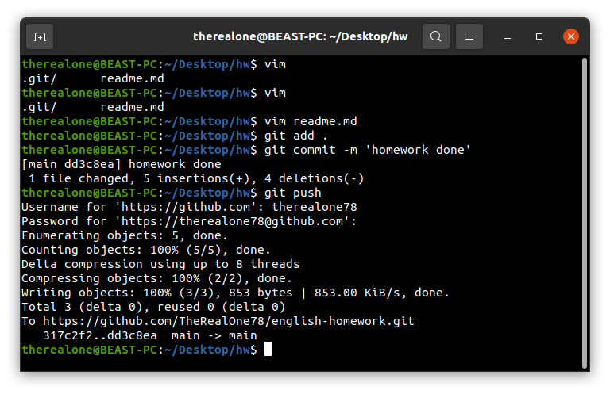

<h1>Bajcsi Elias-Robert's Homework</h1>

<ol>
  <li>Do you think it's important for people to go to school near where they live? Why? Why not?</li>
  <li>Describe the aspect of technology you think has  most impact on your life.</li>
  <li>Do you think travel helps you discover your true identity? Use relevant arguments and examples to support your ideas!</li>
</ol>

<h4>Answers:</h4>

<ol>
  <li>Yes, it is very important because it's not time consuming, if you mess up with the time, you won't get that late to school, and when you come back from school, you won't be very hungry.</li>
  <li>PC's with linux UwUntu. They are big impact for weebs like me. I like anime... :|</li>
  <li>I don't travel. It's a money consumer. I don't need to travel to find my true me. I know me because I am me.</li>
</ol>

_Image taken from https://blog.udemy.com/wp-content/uploads/2014/06/bigstock-English-Wording-And-Books-58790219.jpg_

